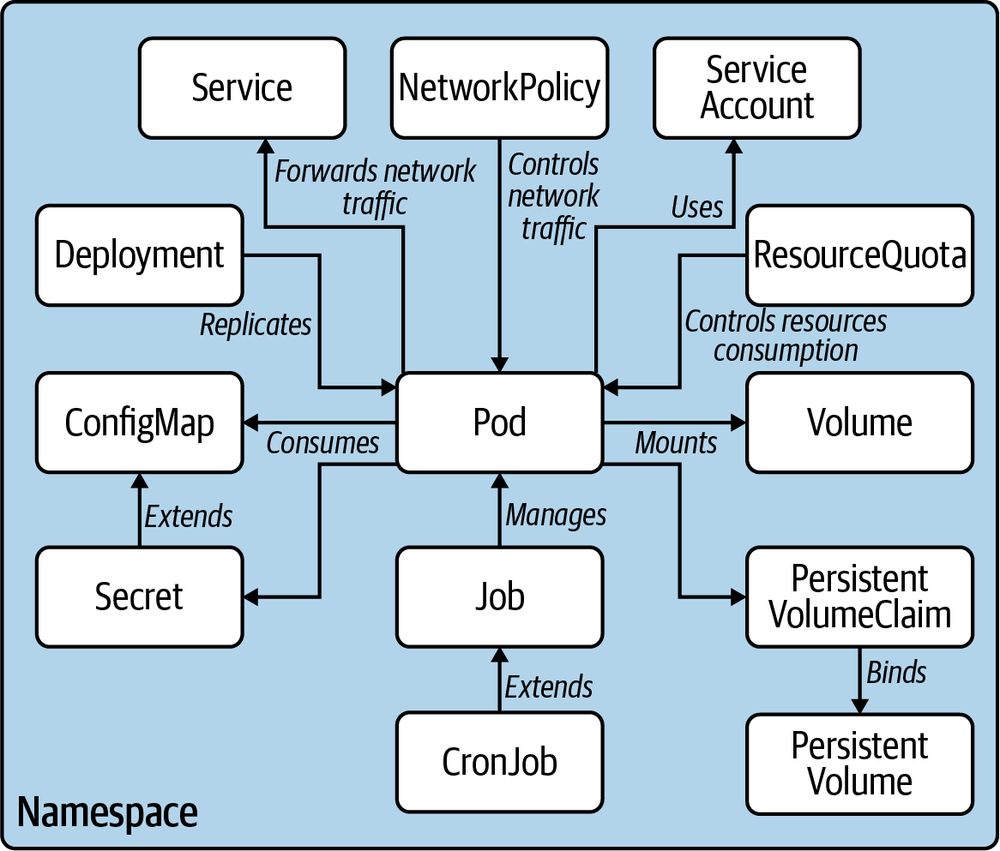

#### Multi-Containter pods

    Three patterns:
    adapater pattern, sidecar pattern and the ambassador pattern.

####  Pod Design

    Labels are an integral concepts in k8s.

#### Service and Networking

    A service is an abstraction layer onb top of a set of Pods that provides
    single interface for defining the network communication. 

#### State Persistence

    Applications in a container perfom I/O only to the container's life
    If the read/write is not associated to an external mount, then the
    file are lost at the end of the container's life.

#### Some Components

#### Deleteing kubernetes objects

    k8s will try to delete gracefully the pod, within 30 secs.

    kubectl delete pod nginx --grace-period=0 --force

### Combining linux command to obtain info about infra

    kubectl describe pods | grep -C 10 "author=John Doe"
    kubectl get pods -o yaml | grep -C 5 labels:

