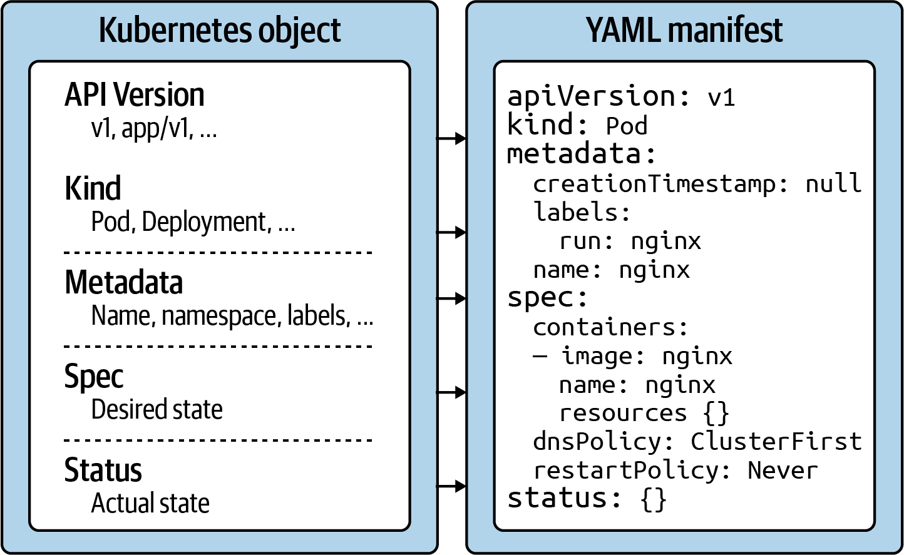

#### Kubernetes primitives

    Are the basic building blocks anchored in the k8s architecture for creating
    and operating an application on the platform. 

#### Analogy with oriented-object programming

    A kubernetes primitive is the equivalent of a class.
    THe instance of a class in object-oriented programming is the
    equivalent of a class. The instance of a class in object-oriented programming
    is an object,managing its owen state and having the ability
    to communicate with other parts of the system. Whenever you create
    a K8s objerct, you produce such an instance.

- Api version:

      Defines the structure of a primitive and uses it to validate
      correctness.

- Kind: 
   
      What type of object are we going to create?

- Metadata:
    
      Metadata describes higher-level information about the object
      its name, what namepsace it lives on, or whateverit defines
      labels and annotations

- Spec:

       The specification(spec for short) declares the desired states,
        how should this object look after it has been created?
- 
- Status:

        The status describes the actual state of an object.
        The k8s cntrollers and their reconciliation loops
        constantly try to transition a k8s objects from the desired
        state into the actual state.
