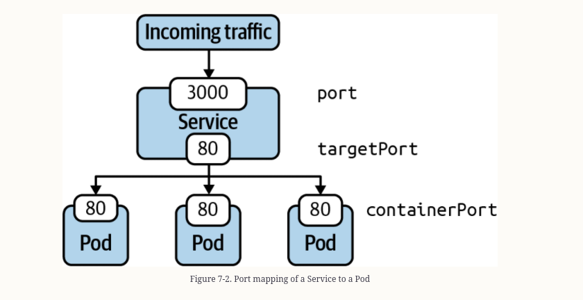

#### Services & Networking

    The primitive Service implements an abstractionlayer on top of Pods,
    assignging a fixed virtual IP fronting all the Pods with the matching lable, and
    that virutal IP is called clusterIP. 

##### Service Types

| Type|Description|
| ---- | -------- |
| ClusterIP | Exposes the Serivce on a cluster-interna IP. Only reachable from within the cluster.|
| NodePort | Exposes the Serivce on each node's IP address at a static port. Accesible from outside of the cluster|
| LoadBalancer | Exposes the service externally using a cloud provider's load balancer | 
| ExternalName | Maps a Service to a DNS name|

#### Commands

    kubectl create service clusterip nginx-service --tcp=80:80

    Expose a pod
    $ kubectl run nginx --image=nginx --restart=Never --port=80 --expose
    service/nginx created
    pod/nginx created

    $ kubectl expose deployment my-deploy --port=80 --target-port=80


```yaml
apiVersion: v1
kind: Service
metadata:
  name: nginx-service
spec:
  type: ClusterIP
  selector:
    app: nginx-service
  ports:
  - port: 80
    targetPort: 80
```

From the illustration any incoming traffic is then routed toward the target port, represented by ports.targetPort
The targetPort is the same port as defined by the container running inside of the label-selected
pod



Accessing pod within cluster

    $ kubectl run nginx --image=nginx --restart=Never --port=80 --expose
    service/nginx created
    pod/nginx created
    $ kubectl get pod,service
    NAME        READY   STATUS    RESTARTS   AGE
    pod/nginx   1/1     Running   0          26s
    
    NAME            TYPE        CLUSTER-IP      EXTERNAL-IP   PORT(S)   AGE
    service/nginx   ClusterIP   10.96.225.204   <none>        80/TCP    26s

    $ kubectl run busybox --image=busybox --restart=Never -it -- /bin/sh
    If you don't see a command prompt, try pressing enter.
    / # wget -O- 10.96.225.204:80
    Connecting to 10.96.225.204:80 (10.96.225.204:80)
    writing to stdout
    <!DOCTYPE html>

### Using proxy command 

    With the proxy command you can establish a direct connection to the kubernetes API
    server from your localhost.
    
    kubectl proxy --port=9999

    curl -L localhost:9999/api/v1/namespaces/default/services/nginx/proxy


### Accessing a service with the NodePort

    Declaring a service with the type NodePort exposes access through the node's IP
    address and can be resolved from outside of the kubernetes cluster.
    The node's ip address can b ereached in combination with a port number.
    
    
