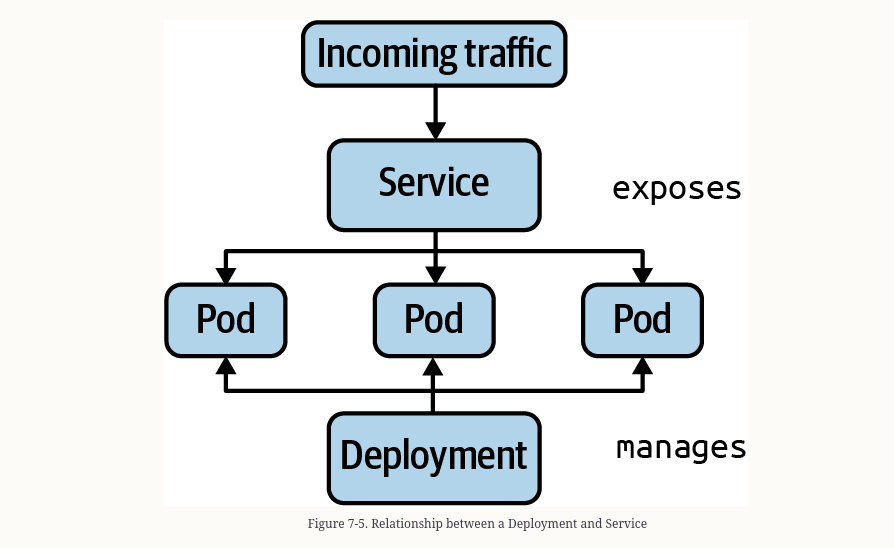
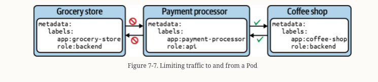

#### Services & Networking

    The primitive Service implements an abstractionlayer on top of Pods,
    assignging a fixed virtual IP fronting all the Pods with the matching lable, and
    that virutal IP is called clusterIP. 

##### Service Types

| Type|Description|
| ---- | -------- |
| ClusterIP | Exposes the Serivce on a cluster-interna IP. Only reachable from within the cluster.|
| NodePort | Exposes the Serivce on each node's IP address at a static port. Accesible from outside of the cluster|
| LoadBalancer | Exposes the service externally using a cloud provider's load balancer | 
| ExternalName | Maps a Service to a DNS name|

#### Commands

    kubectl create service clusterip nginx-service --tcp=80:80

    Expose a pod
    $ kubectl run nginx --image=nginx --restart=Never --port=80 --expose
    service/nginx created
    pod/nginx created

    $ kubectl expose deployment my-deploy --port=80 --target-port=80


```yaml
apiVersion: v1
kind: Service
metadata:
  name: nginx-service
spec:
  type: ClusterIP
  selector:
    app: nginx-service
  ports:
  - port: 80
    targetPort: 80
```

From the illustration any incoming traffic is then routed toward the target port, represented by ports.targetPort
The targetPort is the same port as defined by the container running inside of the label-selected
pod


Accessing pod within cluster

    $ kubectl run nginx --image=nginx --restart=Never --port=80 --expose
    service/nginx created
    pod/nginx created
    $ kubectl get pod,service
    NAME        READY   STATUS    RESTARTS   AGE
    pod/nginx   1/1     Running   0          26s
    
    NAME            TYPE        CLUSTER-IP      EXTERNAL-IP   PORT(S)   AGE
    service/nginx   ClusterIP   10.96.225.204   <none>        80/TCP    26s

    $ kubectl run busybox --image=busybox --restart=Never -it -- /bin/sh
    If you don't see a command prompt, try pressing enter.
    / # wget -O- 10.96.225.204:80
    Connecting to 10.96.225.204:80 (10.96.225.204:80)
    writing to stdout
    <!DOCTYPE html>

### Using proxy command 

    With the proxy command you can establish a direct connection to the kubernetes API
    server from your localhost.
    
    kubectl proxy --port=9999

    curl -L localhost:9999/api/v1/namespaces/default/services/nginx/proxy


### Accessing a service with the NodePort

    Declaring a service with the type NodePort exposes access through the node's IP
    address and can be resolved from outside of the kubernetes cluster.
    The node's ip address can b ereached in combination with a port number.


Changing the type of Service

    $ kubectl patch service nginx -p '{ "spec": {"type": "NodePort"} }'
    service/nginx patched
    $ kubectl get service nginx
    NAME    TYPE       CLUSTER-IP      EXTERNAL-IP   PORT(S)        AGE
    nginx   NodePort   10.96.225.204   <none>        80:32300/TCP   3d21h

Now we need to obtain the node ips address 

    $ kubectl get nodes
    NAME       STATUS   ROLES    AGE   VERSION
    minikube   Ready    master   91d   v1.18.3
    $ kubectl describe node minikube | grep InternalIP:
    InternalIP:  192.168.64.2
    $ curl 192.168.64.2:32300

#### Deployments and Services

    A deployment manages Pods and their replication. A service route network reqeuests to
    a set of Pods.



   Using Network Policy to restrict access from pod to a pod.

#### Attributes for a network policy

| Attribute | Description |
| -------- | ------------ |
| podSelector | Selects the POds in namespace to apply the network policy to.|
| policyType | Defines the type of traffic  |
| ingress | List the rules for incoming traffic. Each rule can define from and ports|
| egress | Lists the rules for outgoing traffic. Each rule can define to and ports sections|


### Example



```yaml
apiVersion: networking.k8s.io/v1
kind: NetworkPolicy
metadata:
  name: api-allow
spec:
  podSelector:
    matchLabels:
      app: payment-processor
      role: api
  ingress:
  - from:
    - podSelector:
        matchLabels:
          app: coffeeshop
```

    $ kubectl run payment-processor --image=nginx --restart=Never \
    -l app=payment-processor,role=api --port 80
    pod/payment-processor created
    $ kubectl get pods -o wide
    NAME              READY STATUS  RESTARTS AGE   IP        NODE     NOMINATED NODE \
    READINESS GATES
    payment-processor 1/1   Running 0        6m43s 10.0.0.51 minikube <none> \
    <none>
    $ kubectl create -f networkpolicy-api-allow.yaml
    networkpolicy.networking.k8s.io/api-allow created

#### Listing Network Policies

    $ kubectl get networkpolicy
    NAME         POD-SELECTOR                     AGE
    api-allow    app=payment-processor,role=api   83m

#### Isolating All Pods in Namespace

```yaml
apiVersion: networking.k8s.io/v1
kind: NetworkPolicy
metadata:
  name: default-deny-all
spec:
  podSelector: {}
  policyTypes:
  - Ingress
  - Egress
```

### Restrict port from access to

```yaml
apiVersion: networking.k8s.io/v1
kind: NetworkPolicy
metadata:
  name: port-allow
spec:
  podSelector:
    matchLabels:
      app: backend
  ingress:
  - from:
    - podSelector:
        matchLabels:
          app: frontend
    ports:
    - protocol: TCP
      port: 8080
```
