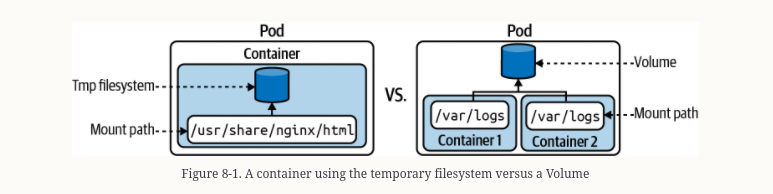
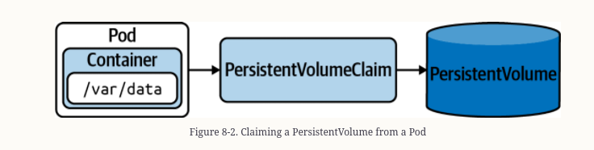

#### State Persistance

    A volume is a Kubernetes capability that persists data beyond a Pod restart.
    Essentially, a Volume is a director that's shareable between multiple containers
    of a Pod.

    Persistent Volumes are specfific category of the wider concept of Volumes. The mechanics
    for Persistent Volume are slightly more complex. The Persistent Volume Claim represents the 
    connectting resource between a Pod and a Persistent Volume responsible for requesting the
    storage.
    Finally the Pod needs to claim the Persistent Volume and mount it to a directory path
    available to the containers running inside of the Pod.
    


Volume Types

| Type | Description |
| ---- | ----------- |
| emptyDir | Empty directory in Pod with read/write access. ONly persisted for the lifespan of a Pod.|
| hostPath | File or directory from the host node's filesystem |
| configMap | Provides a way to inject configuration data| 
| nfs | An existing NFS share. Preserve data after Pod restarts|
| persistenVolumeClaim | Claims a Persistent Volume |


#### Notes

    Defining a volume requires two steps. First you need to declare the Volume itself using the
    attribute spec.volume , expose name and type. Second the volume needs to be mounted to a path
    of the conuming container via spec.containers.volumeMounts.

```yaml
apiVersion: v1
kind: Pod
metadata:
  name: business-app
spec:
  volumes:
  - name: logs-volume
    emptyDir: {}
  containers:
  - image: nginx
    name: nginx
    volumeMounts:
    - mountPath: /var/logs
      name: logs-volume
```
    The Persistent Volume is the storage device in Kubernetes cluster.
    The Persistent Volume is completely decoupled from the Pod and therefore has its own
    lifecycle.
    
    The PersistentVolumeClaim requets the resources fo a Persistent Volume,.



```yaml
apiVersion: v1
kind: Pod
metadata:
  name: app-consuming-pvc
spec:
  volumes:
    - name: app-storage
      persistentVolumeClaim:
        claimName: db-pvc
  containers:
  - image: alpine
    name: app
    command: ["/bin/sh"]
    args: ["-c", "while true; do sleep 60; done;"]
    volumeMounts:
      - mountPath: "/mnt/data"
        name: app-storage
```

